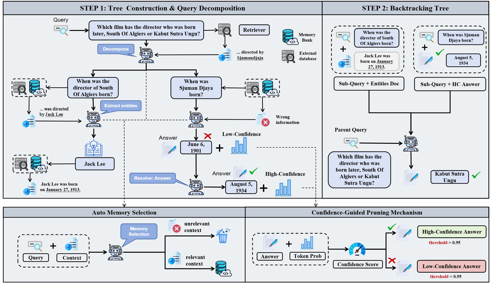
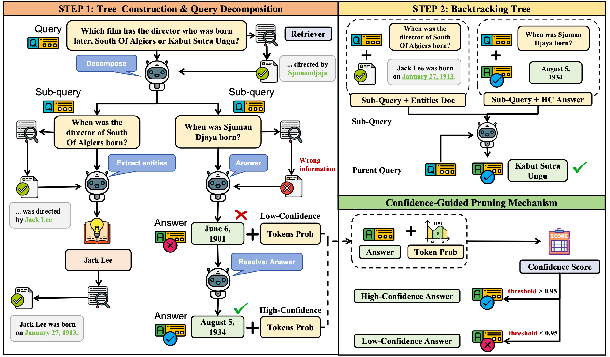
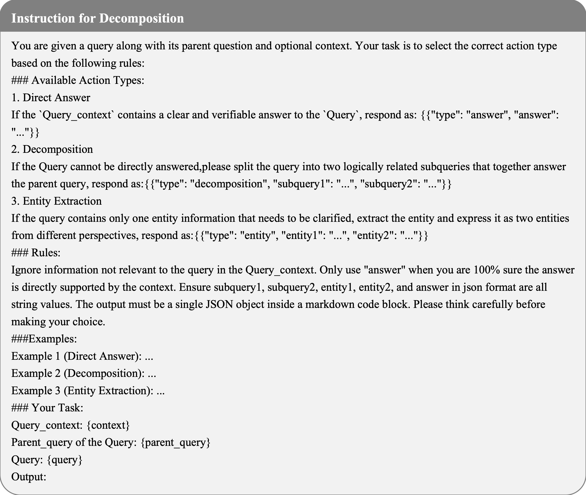
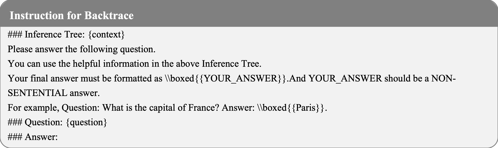
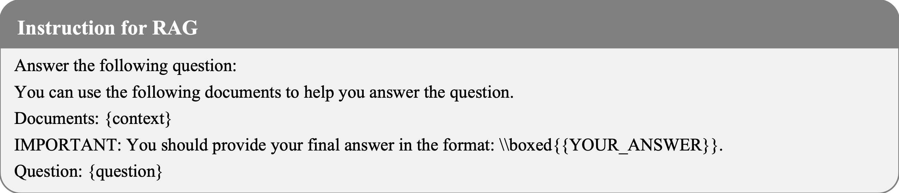

# PruneRAG: Confidence-Guided Query Decomposition Trees for Efficient Retrieval-Augmented Generation

## Project Overview

### M-PruneRAG



Retrieval-augmented generation (RAG) has shown strong potential for improving large language models on knowledge-intensive and multi-hop reasoning tasks. However, as reasoning chains deepen or search trees expand, existing RAG systems often suffer from evidence forgetting, where retrieved knowledge is not effectively used in subsequent reasoning, and inefficiency caused by redundant retrieval and uncontrolled query expansion. These issues are further amplified in tree-structured reasoning, where evidence is typically used locally at each node, leading to fragmented context across reasoning paths and weak global evidence coordination.we propose M-PruneRAG, a memory-augmented, confidence-guided query decomposition framework for stable and efficient retrieval-augmented reasoning. M-PruneRAG organizes complex question answering as a structured query decomposition tree and introduces a shared memory to preserve and reuse high-value evidence across reasoning nodes. Specifically, it integrates adaptive node expansion to control tree growth, confidence-guided answering and pruning to suppress low-value branches, fine-grained retrieval to improve evidence precision, and shared memory retrieval to support parent-child evidence transfer and cross-branch evidence sharing. By combining structured decomposition with cross-node memory reuse, M-PruneRAG improves evidence continuity and reduces retrieval redundancy in multi-hop reasoning.We further introduce the Evidence Forgetting Rate (EFR), a diagnostic metric for cases where golden evidence is retrieved but not correctly used for final answering. Extensive experiments on multiple multi-hop QA benchmarks show that M-PruneRAG consistently outperforms strong baselines in both effectiveness and efficiency, while substantially mitigating evidence forgetting. 


### PruneRAG



Retrieval-augmented generation (RAG) has become a powerful framework for enhancing large language models in knowledgeintensive and reasoning tasks. However, as reasoning chains deepen or search trees expand, RAG systems often face two persistent failures: evidence forgetting, where retrieved knowledge is not effectively used, and inefficiency, caused by uncontrolled query expansions and redundant retrieval. These issues reveal a critical gap between retrieval and evidence utilization in current RAG architectures. We propose PruneRAG, a confidence-guided query decomposition framework that builds a structured query decomposition tree to perform stable and efficient reasoning. PruneRAG introduces three key mechanisms: adaptive node expansion that regulates tree width and depth, confidence-guided decisions that accept reliable answers and prune uncertain branches, and fine-grained retrieval that extracts entity-level anchors to improve retrieval precision. Together, these components preserve salient evidence throughout multi-hop reasoning while significantly reducing retrieval overhead. To better analyze evidence misuse, we define the Evidence Forgetting Rate as a metric to quantify cases where golden evidence is retrieved but not correctly used. Extensive experiments across various multi-hop QA benchmarks show that PruneRAG achieves superior accuracy and efficiency over state-of-the-art baselines.


## Project Structure


The project is organized into the following main components:

- **pipelines/**: Contains various pipeline implementations for different reasoning strategies
  - Other baseline pipelines (cot_pipeline.py, rag_pipeline.py, etc.) for comparison
- **PruneRAG_pipelines/**: Contains various pipeline implementations for different reasoning strategies
  - `tree_pipeline.py`: Core implementation of the Memory-base tree-structured RAG approach
- **M-PruneRAG_pipelines/**: Contains various pipeline implementations for different reasoning strategies
  - `tree_pipeline_auto.py`: Core implementation of the tree-structured RAG approach
- **scripts/**: Contains utility modules for data loading, evaluation, search, and more
- **config/**: Configuration files for dataset paths and other settings
- **figures/**: Visual materials including prompt examples and research figures
- **run_*.sh**: Shell scripts for running different experiments

## Supported Datasets

Tree-RAG supports the following datasets out of the box:
- gpqa, nq, triviaqa, hotpotqa, 2wiki, musique, bamboogle

## Getting Started

### M-PruneRAG
To run the M-PruneRAG system, follow these steps:

1. First, start the retrieval service:
```bash
# Launch the retrieval server
./lanuch_retriever.sh
```

2. Then, evaluate baseline models for comparison:
```bash
# Run baseline models
./run_baselines.sh
```

3. Finally, run the PruneRAG system:
```bash
# Run the M-PruneRAG system
./run_m_prunerag.sh
```


### PruneRAG
To run the PruneRAG system, follow these steps:

1. First, start the retrieval service:
```bash
# Launch the retrieval server
./lanuch_retriever.sh
```

2. Then, evaluate baseline models for comparison:
```bash
# Run baseline models
./run_baselines.sh
```

3. Finally, run the PruneRAG system:
```bash
# Run the PruneRAG system
./run_prunerag.sh
```

## Prompts Examples

Below are the prompt examples used in the Tree-RAG framework (located in the figures directory):


### Instruction for Decomposition


### Instruction for Backtrace


### Instruction for Vanilla


### Instruction for RAG



## Citation
If you find this code useful for your research, please cite our paper:
```
@article{jiao2026prunerag,
  title={PruneRAG: Confidence-Guided Query Decomposition Trees for Efficient Retrieval-Augmented Generation},
  author={Shuguang Jiao, Xinyu Xiao, Yunfan Wei, Shuhan Qi, Chengkai Huang, Quan Z. Michael Sheng and Lina Yao},
  conference={The Web Conference 2026 (WWW)},
  year={2026}
}
```
## License


## Acknowledgements

This project was developed to advance the state-of-the-art in retrieval-augmented generation for complex question answering tasks.
